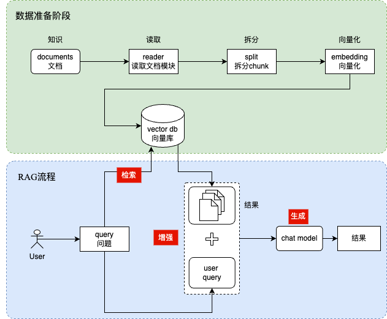

#### 一 需求背景

我们在工作中需要查阅大量的企业文档来获取信息(如规章制度、接口文档、技术实现逻辑等)，这里面存在一下问题

* 系统只负责找到可能相关的文档，理解、提取和整合答案的工作完全落在用户身上。
* 对于复杂问题，用户需要花费大量时间阅读和筛选文档。
* 答案的准确性很大程度上取决于用户输入关键词的精准度和用户自身的阅读理解能力。
* 对于需要综合多篇文档信息、理解上下文或进行简单推理的问题，效果很差。

为了解决问题，设计了一套基于RAG企业知识问答系统，可帮助员工大大提升效率。通过智能问答系统，用户得到的是一个直接、简洁、连贯的自然语言答案。

具体两者的区别如下图所示：

| 特性         | 传统文档搜索系统                    | 基于RAG的知识问答系统                 |
| :----------- | :---------------------------------- | :------------------------------------ |
| **核心任务** | 查找包含关键词的文档                | **理解问题并直接生成答案**            |
| **输入方式** | 关键词、短语、布尔表达式            | **自然语言问题**                      |
| **输出结果** | **相关文档列表/片段**               | **直接的自然语言答案** (附带来源引用) |
| **信息处理** | 关键词匹配、简单排序                | **语义理解检索 + LLM阅读理解与生成**  |
| **用户角色** | **主动查找者** (需自行阅读提炼答案) | **提问者** (接收现成答案)             |
| **效率**     | 较低 (用户需大量阅读)               | **高** (直接获得答案)                 |
| **易用性**   | 需要掌握搜索技巧                    | **非常友好** (自然语言交互)           |
| **复杂问题** | 处理能力弱                          | **处理能力较强** (综合、总结、解释)   |
| **答案形式** | 原始文档信息                        | **结构化、精炼的总结性答案**          |
| **技术基础** | 倒排索引、TF-IDF、BM25等            | **向量检索、大语言模型、深度学习**    |
| **核心价值** | 信息检索                            | **知识提取与交付**                    |

RAG的优势：

*   **降低使用门槛：** 普通员工无需掌握复杂的搜索语法就能快速获取知识。
*   **提升效率：** 大幅缩短员工查找信息的时间，尤其是新员工培训和日常问题咨询。
*   **知识利用更充分：** 让沉淀在文档中的知识更容易被获取和利用，避免“知识孤岛”。
*   **改善用户体验：** 交互更自然、更智能，更像与专家对话。
*   **支持复杂查询：** 能够回答需要跨文档理解和简单推理的问题。

参考书籍：

大模型RAG实战：RAG原理、应用与系统搭建

#### 二 功能总结

| 序号 | 模块           | 内容                   | 备注 |
| ---- | -------------- | ---------------------- | ---- |
| 1    | 知识上传和编辑 | 知识文本上传           |      |
|      |                | 支持知识文本内容的CRUD |      |
| 2    | 对话           | 对话的发送             |      |
|      |                | 检索知识库             |      |
|      |                | 增强拼接prompt检索结果 |      |
| 3    | 聊天内容存储   | 支持聊天内容的增删改查 |      |
| 4    | 登录模块       | 注册                   |      |
|      |                | 登录                   |      |
|      |                | 登出                   |      |

#### 三 总体设计

##### 3.1 使用技术栈

enio+gin

##### 3.2 整体架构

 

#### 四 详细设计

##### 4.1 知识上传和编辑功能

###### 4.1.1 文件的上传

rag/file/upload

###### 4.1.2 支持上传文件的删除

rag/file/delete

##### 4.2 对话过程

###### 4.2.1 普通对话

chat/generate/stream

###### 4.2.2 选中知识库进行对话

###### 4.2.3 支持多轮上下文历史的对话

###### 4.2.4 支持工具调用(MCP或者function calling)

##### 4.3 聊天内容存储

###### 4.3.1 历史聊天模块的增删查

##### 4.4 注册&登录功能

###### 4.4.1 注册

###### 4.4.2 登录

#### 五 测试

#### 六 部署上线

#### 参考文档

【go语言在AI时代的崛起】 https://blog.csdn.net/May_as_well/article/details/149828706

【使用gin的项目布局】
* https://github.com/golang-standards/project-layout 
* https://www.zhihu.com/question/3826829320/answer/28317590233
* https://www.cnblogs.com/topkul/articles/18958997
* https://www.zhihu.com/question/616556462/answer/3225110555

【golang读取.env文件的方式】https://juejin.cn/post/7086668547547463694

